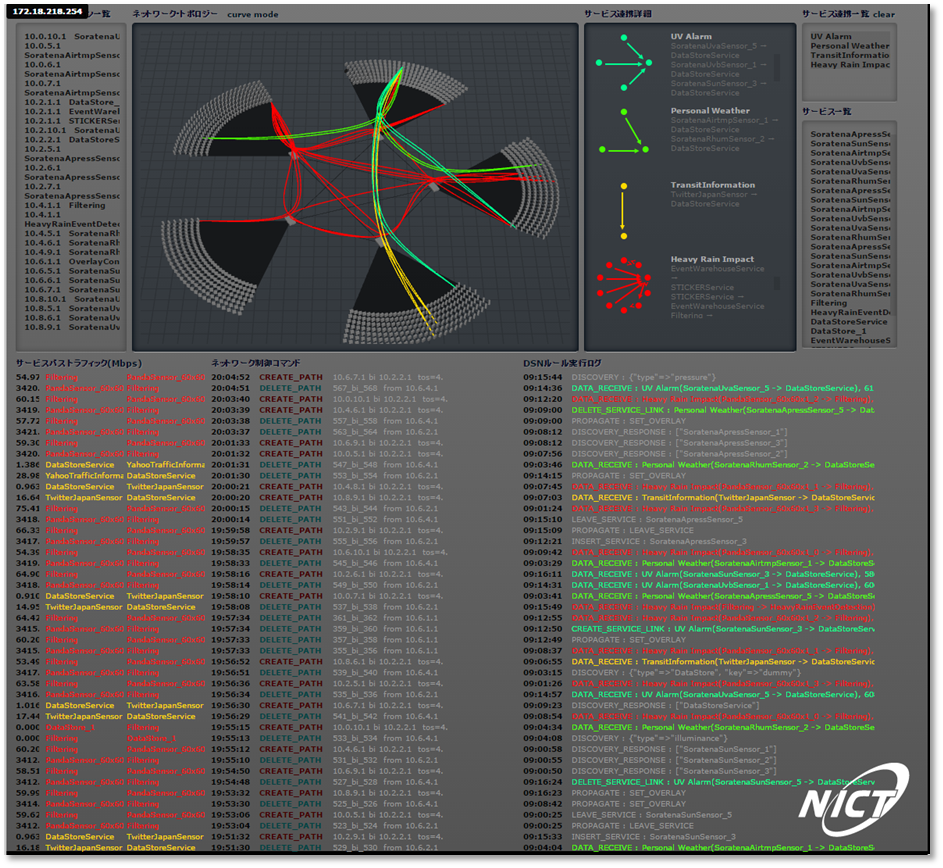

==================
What is SCN Admin?
==================
* SCN Admin is a tool that visualizes operations of topology, service, and service cooperation that are managed by Service-Controlled Networking (SCN) as well as SCN operation.

Features of SCN Admin
=====================

Service location/network topology display
--------------------------------------------------

* Display network topology where SCN is operating.
* Display the IP address of the node where the service is operating.

Service list/Service cooperation list/Service cooperation detail list display
-----------------------------------------------------------------------------

* Display the list of information services that have joined SCN.
* Display the service cooperation that SCN controls.

Service path traffic/network control command/DSN rule execution log display
---------------------------------------------------------------------------

* Display traffic per service path.
* Display a history of network control commands.
* Display the DSN rule execution history.

About SCN development
=====================
SCN is an open source project that is developed by Information Services Platform Laboratory in National Institute of Information and Communications Technology (http://nict.go.jp/univ-com/isp/index.html).

