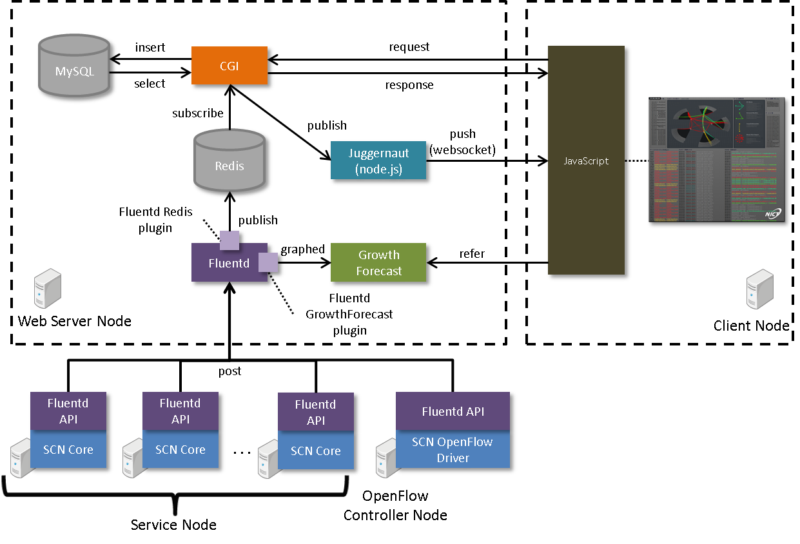

===============
アーキテクチャ
===============

.. _Flask: http://flask.pocoo.org/
.. _nginx: http://nginx.org/en/
.. _gunicorn: http://gunicorn.org/
.. _MySQL: http://www-jp.mysql.com/
.. _Redis: http://redis.io/
.. _node.js: https://nodejs.org/
.. _juggernaut: https://github.com/maccman/juggernaut
.. _fluentd: http://www.fluentd.org/
.. _GrowthForecast: http://kazeburo.github.io/GrowthForecast/

.. _Backbone.js: http://backbonejs.org/
.. _jQuery: https://jquery.com/
.. _Raphael.js: http://raphaeljs.com/
.. _three.js: http://threejs.org/

システム構成
=================
* SCN Adminは、以下のツールおよびライブラリによって構成されています。

+---------------------+----------------------------------------------------------------+---------------------+
| 種別                | ツール/ライブラリ                                              | SCN Adminでの利用   |
+=====================+================================================================+=====================+
| サーバサイド        | webアプリケーションフレームワーク                              | `Flask`_            |
|                     +----------------------------------------------------------------+---------------------+
|                     | webサーバ                                                      | `nginx`_            |
|                     +----------------------------------------------------------------+---------------------+
|                     | HTTPサーバ                                                     | `gunicorn`_         |
|                     +----------------------------------------------------------------+---------------------+
|                     | RDBMS                                                          | `MySQL`_            |
|                     +----------------------------------------------------------------+---------------------+
|                     | NoSQL                                                          | `Redis`_            |
|                     +----------------------------------------------------------------+---------------------+
|                     | サーバサイドのJavaScriptインタープリター                       | `node.js`_          |
|                     +----------------------------------------------------------------+---------------------+
|                     | リアルタイム接続ツール                                         | `juggernaut`_       |
|                     +----------------------------------------------------------------+---------------------+
|                     | データ収集ツール                                               | `fluentd`_          |
|                     +----------------------------------------------------------------+---------------------+
|                     | グラフ化ツール                                                 | `GrowthForecast`_   |
+---------------------+----------------------------------------------------------------+---------------------+
| クライアントサイド  | クライアントMVCを実現するフレームワーク                        | `Backbone.js`_      |
|                     +----------------------------------------------------------------+---------------------+
|                     | 軽量なJavaScriptライブラリ                                     | `jQuery`_           |
|                     +----------------------------------------------------------------+---------------------+
|                     | SVGグラフィックス                                              | `Raphael.js`_       |
|                     +----------------------------------------------------------------+---------------------+
|                     | WebGLグラフィックス                                            | `three.js`_         |
+---------------------+----------------------------------------------------------------+---------------------+

* 全体のシステム構成は以下の通りです。

サーバサイド
-------------
* SCN Adminのサーバサイドは、各ノードからのログ出力を、クライアントサイドで可視化できる形にします。
* カスタマイズはデータ収集ツールプラグインまたはWebアプリケーションに行います。

データ収集ツール
^^^^^^^^^^^^^^^^^
* 各ノードからのログ出力はまず、データ収集ツールで受信します。
* NoSQL用Pluginは、ログ出力をNoSQLサーバーに転送します。
* グラフ化ツール用Pluginは、ログ出力をグラフ化するためのテンポラリな集計と（集計結果はグラフ化ツールへ)、
  その集計結果を参照するためのHTMLを作成します。
* 新しい情報を可視化する際には、まずここにPluginを追加します。

Webアプリケーション
^^^^^^^^^^^^^^^^^^^^
* NoSQLサーバーへの入力をsubscribeし、クライアントサイド向けの情報に加工してpublishします。
* ページ表示時に必要なトポロジーなどのログ出力は、いったんRDBMSに登録し、WebアプリケーションAPIより取得可能にします。

ファイル構成
^^^^^^^^^^^^^
* SCN Adminのサーバサイドを構成するファイルは以下の通りです。

::

  /（リポジトリのルート）
  |
  +- /conf
  |  +- redis.conf                   - Redisの設定
  |  +- td-agent.conf                - Fluentdの設定
  |  +- supervisord.conf             - Webアプリケーションの起動設定
  |  +- gunicorn.production.conf.py  - Webアプリケーションサーバーの設定
  |
  +- /oflogger
  |  +- topology.py                  - トポロジー情報をMySQLに保存するアプリケーション
  |  +- manage.py                    - モデルクラスをアプリケーション化するためのクラス
  |  +- /oflogger/models             - 各種ログ出力情報をJuggernautやMySQL向けに出力するモデルクラス群
  |  +- /configs                     - アプリケーションのコンフィグ
  |
  +- /webapp
  |  +- manage.py                    - アプリケーション化するためのクラス
  |  +- /oflogviewer
  |     +- app.py                    - Webアプリケーションのローダ
  |     +- /configs                  - Webアプリケーションの設定
  |     +- /views/frontend           - WebアプリケーションAPIのアクセス設定（/api/topologyなど）
  |     +- /models                   - WebアプリケーションAPIの処理本体（topology.pyなど）
  |
  +- /td-agent/plugin
     +- redis_output.rb              - Redis用中継プラグイン
     +- statistics_output.rb         - Growthforecast用グラフ出力プラグイン

データベース
=============
* SCN Adminが利用する、MySQLのテーブルは以下の通りです。

::

    +--------------------------+
    | Tables_in_oflogger       |
    +--------------------------+
    | latest_route             |
    | lost_switch              |
    | lost_switchport          |
    | nodelocation             |
    | route                    |
    | servicecommand           |
    | servicelocation          |
    | servicepath              |
    | servicepath_switch_relay |
    | servicetraffic           |
    | switch                   |
    | switchport               |
    +--------------------------+

* 各テーブルのカラムの情報は以下の通りです。

::

    latest_route
    +-----------------+----------+------+-----+---------+----------------+
    | Field           | Type     | Null | Key | Default | Extra          |
    +-----------------+----------+------+-----+---------+----------------+
    | id              | int(11)  | NO   | PRI | NULL    | auto_increment |
    | src_switch_id   | int(11)  | NO   |     | NULL    |                |
    | src_switch_port | int(11)  | NO   |     | NULL    |                |
    | dst_switch_id   | int(11)  | NO   |     | NULL    |                |
    | dst_switch_port | int(11)  | NO   |     | NULL    |                |
    | bandwidth       | int(11)  | NO   |     | NULL    |                |
    | get_data_time   | datetime | NO   | MUL | NULL    |                |
    +-----------------+----------+------+-----+---------+----------------+

    lost_switch
    +--------------------+-------------+------+-----+---------+-------+
    | Field              | Type        | Null | Key | Default | Extra |
    +--------------------+-------------+------+-----+---------+-------+
    | switch_id          | int(11)     | NO   | MUL | NULL    |       |
    | switch_ip          | varchar(50) | NO   |     | NULL    |       |
    | switch_mac         | varchar(50) | YES  |     | NULL    |       |
    | switch_latest_time | datetime    | NO   |     | NULL    |       |
    +--------------------+-------------+------+-----+---------+-------+

    lost_switchport
    +------------------------+-------------+------+-----+---------+-------+
    | Field                  | Type        | Null | Key | Default | Extra |
    +------------------------+-------------+------+-----+---------+-------+
    | switch_id              | int(11)     | NO   | MUL | NULL    |       |
    | switch_ip              | varchar(50) | NO   |     | NULL    |       |
    | switchport_mac         | varchar(50) | NO   |     | NULL    |       |
    | switchport_port        | int(11)     | NO   |     | NULL    |       |
    | switchport_ip          | varchar(50) | YES  |     | NULL    |       |
    | switchport_latest_time | datetime    | NO   |     | NULL    |       |
    +------------------------+-------------+------+-----+---------+-------+

    nodelocation
    +------------------+-------------+------+-----+---------+-------+
    | Field            | Type        | Null | Key | Default | Extra |
    +------------------+-------------+------+-----+---------+-------+
    | node_ip          | varchar(50) | NO   | PRI | NULL    |       |
    | node_mac         | varchar(50) | NO   | PRI | NULL    |       |
    | node_alive       | tinyint(1)  | NO   |     | NULL    |       |
    | switch_id        | int(11)     | NO   | MUL | NULL    |       |
    | switch_port      | int(11)     | NO   |     | NULL    |       |
    | switch_port_name | varchar(20) | YES  |     | NULL    |       |
    | vgw_ip           | varchar(50) | NO   |     | NULL    |       |
    +------------------+-------------+------+-----+---------+-------+

    route
    +-----------------+----------+------+-----+---------+----------------+
    | Field           | Type     | Null | Key | Default | Extra          |
    +-----------------+----------+------+-----+---------+----------------+
    | table_id        | int(11)  | NO   | PRI | NULL    | auto_increment |
    | src_switch_id   | int(11)  | NO   |     | NULL    |                |
    | src_switch_port | int(11)  | NO   |     | NULL    |                |
    | dst_switch_id   | int(11)  | NO   |     | NULL    |                |
    | dst_switch_port | int(11)  | NO   |     | NULL    |                |
    | bandwidth       | int(11)  | NO   |     | NULL    |                |
    | get_data_time   | datetime | NO   | MUL | NULL    |                |
    +-----------------+----------+------+-----+---------+----------------+

    servicecommand
    +--------------------+-------------+------+-----+-------------------+-----------------------------+
    | Field              | Type        | Null | Key | Default           | Extra                       |
    +--------------------+-------------+------+-----+-------------------+-----------------------------+
    | id                 | int(11)     | NO   | PRI | NULL              | auto_increment              |
    | service_name       | varchar(50) | NO   | MUL | NULL              |                             |
    | commands           | text        | YES  |     | NULL              |                             |
    | command_created_at | timestamp   | NO   |     | CURRENT_TIMESTAMP | on update CURRENT_TIMESTAMP |
    +--------------------+-------------+------+-----+-------------------+-----------------------------+

    servicelocation
    +--------------+-------------+------+-----+---------+----------------+
    | Field        | Type        | Null | Key | Default | Extra          |
    +--------------+-------------+------+-----+---------+----------------+
    | id           | int(11)     | NO   | PRI | NULL    | auto_increment |
    | node_ip      | varchar(50) | NO   |     | NULL    |                |
    | service_key  | varchar(50) | NO   | MUL | NULL    |                |
    | service_name | varchar(50) | YES  |     | NULL    |                |
    +--------------+-------------+------+-----+---------+----------------+

    servicepath
    +------------------+-------------+------+-----+---------+----------------+
    | Field            | Type        | Null | Key | Default | Extra          |
    +------------------+-------------+------+-----+---------+----------------+
    | id               | int(11)     | NO   | PRI | NULL    | auto_increment |
    | path_id          | varchar(50) | NO   | MUL | NULL    |                |
    | src_node_mac     | varchar(50) | NO   |     | NULL    |                |
    | src_service_key  | varchar(50) | NO   |     | NULL    |                |
    | src_service_name | varchar(50) | NO   |     | NULL    |                |
    | dst_node_mac     | varchar(50) | NO   |     | NULL    |                |
    | dst_service_key  | varchar(50) | NO   |     | NULL    |                |
    | dst_service_name | varchar(50) | NO   |     | NULL    |                |
    +------------------+-------------+------+-----+---------+----------------+

    servicepath_switch_relay
    +------------------+-------------+------+-----+---------+-------+
    | Field            | Type        | Null | Key | Default | Extra |
    +------------------+-------------+------+-----+---------+-------+
    | path_id          | varchar(50) | NO   | PRI | NULL    |       |
    | switch_id        | int(11)     | NO   | PRI | NULL    |       |
    | switch_port      | int(11)     | NO   | PRI | NULL    |       |
    | switch_port_name | varchar(50) | NO   |     | NULL    |       |
    | ordered_id       | int(11)     | NO   | PRI | NULL    |       |
    +------------------+-------------+------+-----+---------+-------+

    servicetraffic
    +------------------+---------------+------+-----+---------+-------+
    | Field            | Type          | Null | Key | Default | Extra |
    +------------------+---------------+------+-----+---------+-------+
    | path_id          | varchar(50)   | NO   | PRI | NULL    |       |
    | src_service_name | varchar(50)   | NO   | PRI | NULL    |       |
    | dst_service_name | varchar(50)   | NO   | PRI | NULL    |       |
    | traffic          | decimal(10,3) | NO   |     | NULL    |       |
    +------------------+---------------+------+-----+---------+-------+

    switch
    +--------------------+---------------+------+-----+---------+-------+
    | Field              | Type          | Null | Key | Default | Extra |
    +--------------------+---------------+------+-----+---------+-------+
    | switch_id          | int(11)       | NO   | PRI | NULL    |       |
    | switch_ip          | varchar(50)   | NO   | PRI | NULL    |       |
    | switch_mac         | varchar(50)   | YES  |     | NULL    |       |
    | switch_latest_time | datetime      | NO   |     | NULL    |       |
    | switch_flag        | enum('Y','N') | NO   |     | NULL    |       |
    +--------------------+---------------+------+-----+---------+-------+

    switchport
    +------------------------+---------------+------+-----+---------+-------+
    | Field                  | Type          | Null | Key | Default | Extra |
    +------------------------+---------------+------+-----+---------+-------+
    | switch_id              | int(11)       | NO   | MUL | NULL    |       |
    | switch_ip              | varchar(50)   | NO   |     | NULL    |       |
    | switchport_mac         | varchar(50)   | NO   | PRI | NULL    |       |
    | switchport_port        | int(11)       | NO   | PRI | NULL    |       |
    | switchport_ip          | varchar(50)   | YES  |     | NULL    |       |
    | switchport_latest_time | datetime      | NO   |     | NULL    |       |
    | switchport_flag        | enum('Y','N') | NO   |     | NULL    |       |
    +------------------------+---------------+------+-----+---------+-------+

クライアントサイド
-------------------
* SCN Adminのクライアントサイドは、サーバサイドが成形した、各ノードからのログ出力を可視化します。
* カスタマイズは、/scnv以下に行います。

ファイル構成
^^^^^^^^^^^^^
* SCN Adminのクライアントサイドを構成するファイルは以下の通りです。

::

  /（リポジトリのルート）
  |
  +- /conf
  |  +- /nginx                       - Webサーバーの設定
  |
  +- /webapp/oflogviewer/static      - 以下はWebから直接アクセス可能なファイル
     +- /js                          - Webアプリケーション用の設定およびライブラリ群
     +- /scnv
        +- application.js            - Juggernaut用の設定
        +- index.html                - SCN-Visualizerの利用者用ページ（DOM構成）
        +- admin.html                - SCN-Visualizerの管理者用ページ
        +- /css                      - SCN-VisualizerのCSS群
        |  +- default.css            - 適用するスタイル
        |
        +- /img                      - SCN-Visualizerの画像群
        +- /js
           +- app.js                 - アプリケーションのエントリポイント（利用者・管理者用ページ）
           +- template.js            - テンプレート
           +- その他.js              - その他クラス群。ドキュメント参照
           +- /vendor                - ライブラリ群

通信データ
===========

* サービスノード、およびOpenFlowコントローラノードからwebサーバへ送信するデータはJSON形式です。
* データに含まれるキー、およびルールを使用し、データごとの表示処理を実施します。

サービスノードからwebサーバへの送信データ
------------------------------------------

ログ表示
^^^^^^^^^
::

    (フォーマット)
    {
        "type": メソッドタイプ,
        "key" : NoSQLキー,
        "data": {
            "Code"     : DSN実行コマンド,
            "Rule"     : ルールID("dummy"固定),
            "Src"      : データ送信元("dummy"固定),
            "Time"     : データ送信時刻,
            "Timestamp": データ送信時刻のミリ秒
        }
    }

    (例)
    {
        "type": "publish",
        "key" : "overlay",
        "data": {
            "Code"     : "DISCOVERY_RESPONSE : [\"EventWarehouseService\"]",
            "Rule"     : "dummy",
            "Src"      : "dummy",
            "Time"     : "10:07:12.457",
            "Timestamp": 457
        }
    }

サービス参加通知
^^^^^^^^^^^^^^^^^
::

    (フォーマット)
    {
        "type": メソッドタイプ,
        "key" : NoSQLキー,
        "data": {
            "Code"     : DSN実行コマンド,
            "Rule"     : ルールID,
            "Src"      : サービス名,
            "Time"     : データ送信時刻,
            "Timestamp": データ送信時刻のミリ秒
        }
    }

    (例)
    {
        "type": "publish",
        "key" : "overlay",
        "data": {
            "Code"     : "INSERT_SERVICE : DataStoreService",
            "Rule"     : "r1",
            "Src"      : "DataStoreService",
            "Time"     : "10:07:12.219",
            "Timestamp": 219
        }
    }

サービス離脱通知
^^^^^^^^^^^^^^^^^
::

    (フォーマット)
    {
        "type": メソッドタイプ,
        "key" : NoSQLキー,
        "data": {
            "Code"     : DSN実行コマンド,
            "Rule"     : ルールID,
            "Src"      : 離脱サービス名,
            "Time"     : データ送信時刻,
            "Timestamp": データ送信時刻のミリ秒
        }
    }

    (例)
    {
        "type": "publish",
        "key" : "overlay",
        "data": {
            "Code"     : "LEAVE_SERVICE : SoratenaUvaSensor_5",
            "Rule"     : "r7",
            "Src"      : "SoratenaUvaSensor_5",
            "Time"     : "10:23:10.071",
            "Timestamp": 71
        }
    }

チャネル生成通知(サービス連携)
^^^^^^^^^^^^^^^^^^^^^^^^^^^^^^^
::

    (フォーマット)
    {
        "type": メソッドタイプ,
        "key" : NoSQLキー,
        "data": {
            "Code"     : DSN実行コマンド,
            "Rule"     : ルールID,
            "Src"      : データ送信元サービス名,
            "Dst"      : データ送信先サービス名,
            "Uid"      : サービス連携名,
            "Time"     : データ送信時刻,
            "Timestamp": データ送信時刻のミリ秒,
            "Value"    : {
                "add.src" : データ送信元サービス名,
                "add.dst" : データ送信先サービス名,
                "add.uid" : サービス連携名,
                "add.no"  : 双方向パスID,
                "src.path": 送信元パスID,
                "dst.path": 送信先パスID
            }
        }
    }

    (例)
    {
        "type": "publish",
        "key" : "overlay",
        "data": {
            "Code"     : "CREATE_SERVICE_LINK : UV Alarm(SoratenaSunSensor_5 -> DataStoreService)",
            "Rule"     : "r2",
            "Src"      : "SoratenaSunSensor_5",
            "Dst"      : "DataStoreService",
            "Uid"      : "UV Alarm",
            "Time"     : "10:12:53.623",
            "Timestamp": 623,
            "Value"    : {
                "add.src" : "SoratenaSunSensor_5",
                "add.dst" : "DataStoreService",
                "add.uid" : "UV Alarm",
                "add.no"  : "241_bi_242",
                "src.path": "241",
                "dst.path": "242"
            }
        }
    }

チャネル作成通知(パス)
^^^^^^^^^^^^^^^^^^^^^^^
::

    (フォーマット)
    {
        "type": メソッドタイプ,
        "key" : NoSQLキー,
        "data": {
            "Code"     : DSN実行コマンド(null固定),
            "Rule"     : ルールID,
            "Src"      : データ送信元サービス名,
            "Dst"      : データ送信先サービス名,
            "Uid"      : サービス連携名,
            "Time"     : データ送信時刻,
            "Timestamp": データ送信時刻のミリ秒,
            "Value"    : {
                "src.path": 送信元パスID,
                "dst.path": 送信先パスID
            }
        }
    }

    (例)
    {
        "type": "publish",
        "key" : "overlay",
        "data": {
            "Code"     : null,
            "Rule"     : "cr",
            "Src"      : "SoratenaUvaSensor_4",
            "Dst"      : "DataStoreService",
            "Uid"      : "UV Alarm",
            "Time"     : "10:07:54.729",
            "Timestamp": 729,
            "Value"    : {
                "src.path": "231",
                "dst.path": "232"
            }
        }
    }

チャネル削除通知(サービス連携)
^^^^^^^^^^^^^^^^^^^^^^^^^^^^^^^
::

    (フォーマット)
    {
        "type": メソッドタイプ,
        "key" : NoSQLキー,
        "data": {
            "Code"     : DSN実行コマンド,
            "Rule"     : ルールID,
            "Src"      : データ送信元サービス名,
            "Dst"      : データ送信先サービス名,
            "Uid"      : サービス連携名,
            "Time"     : データ送信時刻,
            "Timestamp": データ送信時刻のミリ秒,
            "Value"    : {
                "seq.src" : データ送信元サービス名,
                "seq.dst" : データ送信先サービス名,
                "seq.uid" : サービス連携名,
                "seq.no"  : 双方向パスID,
                "src.path": 送信元パスID,
                "dst.path": 送信先パスID
            }
        }
    }

    (例)
    {
        "type": "publish",
        "key" : "overlay",
        "data": {
            "Code"     : "DELETE_SERVICE_LINK : UV Alarm(SoratenaUvaSensor_4 -> DataStoreService)",
            "Rule"     : "r3",
            "Src"      : "SoratenaUvaSensor_4",
            "Dst"      : "DataStoreService",
            "Uid"      : "UV Alarm",
            "Time"     : "10:12:58.236",
            "Timestamp": 236,
            "Value"    : {
                "seq.src" : "SoratenaUvaSensor_4",
                "seq.dst" : "DataStoreService",
                "seq.uid" : "UV Alarm",
                "seq.no"  : "231_bi_232",
                "src.path": "231",
                "dst.path": "232"
            }
        }
    }

チャネル削除通知(パス)
^^^^^^^^^^^^^^^^^^^^^^^
::

    (フォーマット)
    {
        "type": メソッドタイプ,
        "key" : NoSQLキー,
        "data": {
            "Code"     : DSN実行コマンド(null固定),
            "Rule"     : ルールID,
            "Src"      : データ送信元サービス名,
            "Dst"      : データ送信先サービス名,
            "Uid"      : サービス連携名,
            "Time"     : データ送信時刻,
            "Timestamp": データ送信時刻のミリ秒,
            "Value"    : {
                "src.path": 送信元パスID,
                "dst.path": 送信先パスID
            }
        }
    }

    (例)
    {
        "type": "publish",
        "key" : "overlay",
        "data": {
            "Code"     : null,
            "Rule"     : "dr",
            "Src"      : "SoratenaSunSensor_4",
            "Dst"      : "DataStoreService",
            "Uid"      : "UV Alarm",
            "Time"     : "10:12:52.015",
            "Timestamp": 15,
            "Value"    : {
                "src.path": "229",
                "dst.path": "230"
            }
        }
    }

データ受信通知
^^^^^^^^^^^^^^^
::

    (フォーマット)
    {
        "type": メソッドタイプ,
        "key" : NoSQLキー,
        "data": {
            "Code"     : DSN実行コマンド,
            "Rule"     : ルールID,
            "Src"      : データ送信元サービス名,
            "Dst"      : データ送信先サービス名,
            "Uid"      : サービス連携名,
            "Time"     : データ送信時刻,
            "Timestamp": データ送信時刻のミリ秒,
            "Value"    : {
                "recv.src": データ送信元サービス名,
                "recv.dst": データ送信先サービス名,
                "recv.uid": サービス連携名,
                "recv.no" : null(固定),
                "src.path": null(固定),
                "dst.path": null(固定)
            }
        }
    }

    (例)
    {
        "type": "publish",
        "key" : "overlay",
        "data": {
            "Code"     : "DATA_RECEIVE : TransitInformation(TwitterJapanSensor -> DataStoreService), 1313[byte]",
            "Rule"     : "r0",
            "Src"      : "TwitterJapanSensor",
            "Dst"      : "DataStoreService",
            "Uid"      : "TransitInformation",
            "Time"     : "10:07:25.964",
            "Timestamp": 964,
            "Value"    : {
                "recv.src": "TwitterJapanSensor",
                "recv.dst": "DataStoreService",
                "recv.uid": "TransitInformation",
                "recv.no" : null,
                "src.path": null,
                "dst.path": null
            }
        }
    }

サービス位置通知
^^^^^^^^^^^^^^^^^
::

    (フォーマット)
    {
        "type": メソッドタイプ,
        "key" : NoSQLキー,
        "data": {
            "service_key" : サービスID,
            "service_name": サービス名,
            "mode"        : アップデートモード(ADD or DEL),
            "node_ip"     : サービスノードIPアドレス,
            "Time"        : データ送信時刻,
            "Timestamp"   : データ送信時刻のミリ秒
        }
    }

    (例)
    {
        "type": "publish",
        "key" : "servicelocation",
        "data": {
            "service_key" : "DataStore_1",
            "service_name": "DataStore_1",
            "mode"        : "ADD",
            "node_ip"     : "10.2.1.1",
            "Time"        : "10:07:11.949",
            "Timestamp"   : 949
        }
    }

OpenFlowコントローラからwebサーバへの送信データ
------------------------------------------------

経路情報
^^^^^^^^^
::

    (フォーマット)
    {
        "type": メソッドタイプ,
        "key" : NoSQLキー,
        "data": [
        {
            "bandwidth"      : バンド幅(Mbps),
            "src_switch_id"  : 送信元OpenFlowスイッチID,
            "src_switch_port": 送信元OpenFlowスイッチポート番号,
            "dst_switch_id"  : 送信先OpenFlowスイッチID,
            "dst_switch_port": 送信先OpenFlowスイッチポート番号
        },
            ：
        ]
    }

    (例)
    {
        "type": "publish",
        "key" : "bandwidth",
        "data": [
        {
            "bandwidth"      : "191.751029746",
            "src_switch_id"  : "3",
            "src_switch_port": "204",
            "dst_switch_id"  : "5",
            "dst_switch_port": "203"
        },
            ：
        ]
    }

トポロジ情報
^^^^^^^^^^^^^
::

    (フォーマット)
    {
        "type": メソッドタイプ,
        "key" : NoSQLキー,
        "data": [
        {
            "switch": {
                "id" : OpenFlowスイッチID,
                "ip" : OpenFlowスイッチノードIPアドレス,
                "mac": OpenFlowスイッチノードMACアドレス(""固定),
                "switchport": [
                    {
                        "ip"  : OpenFlowスイッチポートIPアドレス,
                        "mac" : OpenFlowスイッチポートMACアドレス,
                        "port": OpenFlowスイッチポート番号
                    },
                    ：
                ]
            }
        },
            ：
        ]
    }

    (例)
    {
        "type": "publish",
        "key" : "topology",
        "data": [
        {
            "switch": {
                "id": "1",
                "ip": "172.18.210.254",
                "mac": "",
                "switchport": [
                    {
                        "ip"  : "10.0.1.254",
                        "mac" : "00:00:00:00:10:01",
                        "port": "1"
                    },
                    ：
                ]
            }
        },
            ：
        ]
    }

サービスノード位置情報
^^^^^^^^^^^^^^^
::

    (例)
    {
        "type": メソッドタイプ,
        "key" : NoSQLキー,
        "data": [
        {
            "node_alive" : サービスノード生存状態(true or false),
            "node_ip"    : サービスノードIPアドレス,
            "node_mac"   : サービスノードMACアドレス,
            "sw_id"      : OpenFlowスイッチID,
            "sw_port"    : OpenFlowスイッチポート番号,
            "sw_portName": OpenFlowスイッチポート名,
            "vGW_IP"     : OpenFlowスイッチ(仮想GateWay)IPアドレス
        },
            ：
        ]
    }

    (例)
    {
        "type": "publish",
        "key" : "nodelocation",
        "data": [
        {
            "node_alive" : true,
            "node_ip"    : "10.0.1.1",
            "node_mac"   : "00:50:56:89:6b:fb",
            "sw_id"      : "1",
            "sw_port"    : 1,
            "sw_portName": "eth1.1001",
            "vGW_IP"     : "10.0.1.254"
        },
            ：
        ]
    }

パス情報
^^^^^^^^^
::

    (フォーマット)
    {
        "type": メソッドタイプ,
        "key" : NoSQLキー,
        "data": [
        {
            "srcNode_Mac"    : データ送信元ノードMACアドレス,
            "srcService_key" : データ送信元サービスキー("dummy"固定),
            "srcService_name": データ送信元サービス名("dummy"固定),
            "dstNode_Mac"    : データ送信先ノードMACアドレス,
            "dstService_key" : データ送信先サービスキー("dummy"固定),
            "dstService_name": データ送信先サービス名("dummy"固定),
            "path_id"        : パスID,
            "switch": [
                {
                    "id"         : OpenFlowスイッチID,
                    "sw_port"    : OpenFlowスイッチポート番号,
                    "sw_portName": OpenFlowスイッチポート名
                },
                ：
            ]
        },
            ：
        ]
    }

    (例)
    {
        "type": "publish",
        "key" : "path",
        "data": [
        {
            "srcNode_Mac"    : "00:50:56:89:6c:fc",
            "srcService_key" : "dummy",
            "srcService_name": "dummy",
            "dstNode_Mac"    : "00:50:56:89:6c:fc",
            "dstService_key" : "dummy",
            "dstService_name": "dummy",
            "path_id"        : 201,
            "switch": [
                {
                    "id"         : 2,
                    "sw_port"    : 2,
                    "sw_portName": "eth1.1202"
                },
                ：
            ]
        },
            ：
        ]
    }

使用帯域情報
^^^^^^^^^^^^^
::

    (フォーマット)
    {
        "type": メソッドタイプ,
        "key" : NoSQLキー,
        "data": [
        {
            "srcService_key" : データ送信元サービスキー("dummy"固定),
            "srcService_name": データ送信元サービス名("dummy"固定)",
            "dstService_key" : データ送信先サービスキー("dummy"固定)",
            "dstService_name": データ送信先サービス名("dummy"固定)",
            "traffic"        : パストラフィック(Mbps),
            "path_id"        : パスID
        },
            ：
        ]
    }

    (例)
    {
        "type": "publish",
        "key" : "traffic",
        "data": [
        {
            "srcService_key" : "dummy",
            "srcService_name": "dummy",
            "dstService_key" : "dummy",
            "dstService_name": "dummy",
            "traffic"        : 0,
            "path_id"        : 1
        },
            ：
        ]
    }

コマンド情報
^^^^^^^^^^^^^
::

    (フォーマット)
    {
        "type": メソッドタイプ,
        "key" : NoSQLキー,
        "data": [
        {
            "commands": [
                {
                    "command"  : ネットワーク制御コマンド
                    "timestamp": メッセージタイムスタンプ
                },
                ：
                }
            ],
            "service_key": サービスキー("dummy"固定)
        }
        ]
    }

    (例)
    {
        "type": "publish",
        "key" : "command",
        "data": [
        {
            "commands": [
                {
                    "command"  : "{\"NAME\":\"INITIALIZE_REQUEST\", …
                    "timestamp": 1416963909.965215
                },
                ：
                }
            ],
            "service_key": "dummy"
        }
        ]
    }

