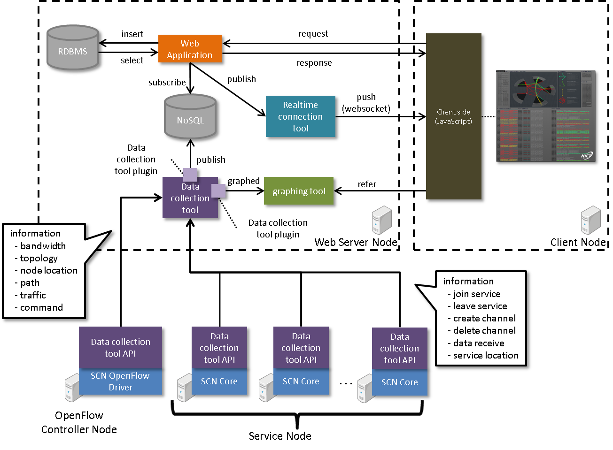

===============
アーキテクチャ
===============

.. _Flask: http://flask.pocoo.org/
.. _nginx: http://nginx.org/en/
.. _gunicorn: http://gunicorn.org/
.. _MySQL: http://www-jp.mysql.com/
.. _Redis: http://redis.io/
.. _node.js: https://nodejs.org/
.. _juggernaut: https://github.com/maccman/juggernaut
.. _fluentd: http://www.fluentd.org/
.. _GrowthForecast: http://kazeburo.github.io/GrowthForecast/

.. _Backbone.js: http://backbonejs.org/
.. _jQuery: https://jquery.com/
.. _Raphael.js: http://raphaeljs.com/
.. _three.js: http://threejs.org/

システム構成
=================
* SCN Adminは、以下のツールおよびライブラリによって構成されています。

+---------------------+---------------------+----------------------------------------------------------------+
| 種別                | ツール/ライブラリ   | 概要                                                           |
+=====================+=====================+================================================================+
| サーバサイド        | `Flask`_            | Python用の軽量なwebアプリケーションフレームワーク              |
|                     +---------------------+----------------------------------------------------------------+
|                     | `nginx`_            | webサーバ                                                      |
|                     +---------------------+----------------------------------------------------------------+
|                     | `gunicorn`_         | Python用のHTTPサーバ                                           |
|                     +---------------------+----------------------------------------------------------------+
|                     | `MySQL`_            | RDBMS                                                          |
|                     +---------------------+----------------------------------------------------------------+
|                     | `Redis`_            | NoSQL                                                          |
|                     +---------------------+----------------------------------------------------------------+
|                     | `node.js`_          | サーバサイドのJavaScript インタープリター                      |
|                     +---------------------+----------------------------------------------------------------+
|                     | `juggernaut`_       | サーバからクライアントへのデータpushを可能にするするライブラリ |
|                     +---------------------+----------------------------------------------------------------+
|                     | `fluentd`_          | ログ収集ライブラリ                                             |
|                     +---------------------+----------------------------------------------------------------+
|                     | `GrowthForecast`_   | グラフ化ツール                                                 |
+---------------------+---------------------+----------------------------------------------------------------+
| クライアントサイド  | `Backbone.js`_      | クライアントMVCを実現するフレームワーク                        |
|                     +---------------------+----------------------------------------------------------------+
|                     | `jQuery`_           | 軽量なJavaScriptライブラリ                                     |
|                     +---------------------+----------------------------------------------------------------+
|                     | `Raphael.js`_       | SVGグラフィックス                                              |
|                     +---------------------+----------------------------------------------------------------+
|                     | `three.js`_         | WebGLグラフィックス                                            |
+---------------------+---------------------+----------------------------------------------------------------+

* 全体のシステム構成は以下の通りです。

データベース
=============
* SCN Adminが利用する、MySQLのテーブルは以下の通りです。

::

    +--------------------------+
    | Tables_in_oflogger       |
    +--------------------------+
    | latest_route             |
    | lost_switch              |
    | lost_switchport          |
    | nodelocation             |
    | route                    |
    | servicecommand           |
    | servicelocation          |
    | servicepath              |
    | servicepath_switch_relay |
    | servicetraffic           |
    | switch                   |
    | switchport               |
    +--------------------------+

通信データ
===========

* サービスノード、およびOpenFlowコントローラノードからwebサーバへ送信するデータは以下の通りです。
  データの例を示します。
  データに含まれるキー、およびルールを使用し、データごとの表示処理を実施します。

サービスノードからwebサーバへの送信データ
------------------------------------------

ログ表示
^^^^^^^^^
* キー：overlay
* ルール：dummy
* データ構造：

::

     {
         "Code": "DISCOVERY_RESPONSE : [\"EventWarehouseService\"]",
         "Rule": "dummy",
         "Src": "dummy",
         "Time": "10:07:12.457",
         "Timestamp": 457
     }

データ受信通知
^^^^^^^^^^^^^^^
* キー：overlay
* ルール：r0
* データ構造：

::

     {
         "Code": "DATA_RECEIVE : TransitInformation(TwitterJapanSensor -> DataStoreService), 1313[byte]",
         "Dst": "DataStoreService",
         "Rule": "r0",
         "Src": "TwitterJapanSensor",
         "Time": "10:07:25.964",
         "Timestamp": 964,
         "Uid": "TransitInformation",
         "Value": {
             "dst.path": null,
             "recv.dst": "DataStoreService",
             "recv.no": null,
             "recv.src": "TwitterJapanSensor",
             "recv.uid": "TransitInformation",
             "src.path": null
         }
     }

サービス参加通知
^^^^^^^^^^^^^^^^^
* キー：overlay
* ルール：r0
* データ構造：

::

     {
         "Code": "INSERT_SERVICE : DataStoreService",
         "Rule": "r1",
         "Src": "DataStoreService",
         "Time": "10:07:12.219",
         "Timestamp": 219
     }

サービスリンク作成通知
^^^^^^^^^^^^^^^^^^^^^^^
* キー：overlay
* ルール：cr
* データ構造：

::

     {
         "Code": null,
         "Dst": "DataStoreService",
         "Rule": "cr",
         "Src": "SoratenaUvaSensor_4",
         "Time": "10:07:54.729",
         "Timestamp": 729,
         "Uid": "UV Alarm",
         "Value": {
             "dst.path": "232",
             "src.path": "231"
         }
     }

* キー：overlay
* ルール：r2
* データ構造：

::

     {
         "Code": "CREATE_SERVICE_LINK : UV Alarm(SoratenaSunSensor_5 -> DataStoreService)",
         "Dst": "DataStoreService",
         "Rule": "r2",
         "Src": "SoratenaSunSensor_5",
         "Time": "10:12:53.623",
         "Timestamp": 623,
         "Uid": "UV Alarm",
         "Value": {
             "add.dst": "DataStoreService",
             "add.no": "241_bi_242",
             "add.src": "SoratenaSunSensor_5",
             "add.uid": "UV Alarm",
             "dst.path": "242",
             "src.path": "241"
         }
     }

サービスリンク削除通知
^^^^^^^^^^^^^^^^^^^^^^^
* キー：overlay
* ルール：r3
* データ構造：

::

     {
         "Code": "DELETE_SERVICE_LINK : UV Alarm(SoratenaUvaSensor_4 -> DataStoreService)",
         "Dst": "DataStoreService",
         "Rule": "r3",
         "Src": "SoratenaUvaSensor_4",
         "Time": "10:12:58.236",
         "Timestamp": 236,
         "Uid": "UV Alarm",
         "Value": {
             "dst.path": "232",
             "seq.dst": "DataStoreService",
             "seq.no": "231_bi_232",
             "seq.src": "SoratenaUvaSensor_4",
             "seq.uid": "UV Alarm",
             "src.path": "231"
         }
     }

* キー：overlay
* ルール：dr
* データ構造：

::

     {
         "Code": null,
         "Dst": "DataStoreService",
         "Rule": "dr",
         "Src": "SoratenaSunSensor_4",
         "Time": "10:12:52.015",
         "Timestamp": 15,
         "Uid": "UV Alarm",
         "Value": {
             "dst.path": "230",
             "src.path": "229"
         }
     }

サービス離脱通知
^^^^^^^^^^^^^^^^^
* キー：overlay
* ルール：r7
* データ構造：

::

     {
         "Code": "DELETE_SERVICE_LINK : UV Alarm(SoratenaUvaSensor_4 -> DataStoreService)",
         "Dst": "DataStoreService",
         "Rule": "r3",
         "Src": "SoratenaUvaSensor_4",
         "Time": "10:12:58.236",
         "Timestamp": 236,
         "Uid": "UV Alarm",
         "Value": {
             "dst.path": "232",
             "seq.dst": "DataStoreService",
             "seq.no": "231_bi_232",
             "seq.src": "SoratenaUvaSensor_4",
             "seq.uid": "UV Alarm",
             "src.path": "231"
         }
     }

サービス位置通知
^^^^^^^^^^^^^^^^^
* キー：servicelocation
* ルール：-
* データ構造：

::

    {
        "Time": "10:07:11.949",
        "Timestamp": 949,
        "mode": "ADD",
        "node_ip": "10.2.1.1",
        "service_key": "DataStore_1",
        "service_name": "DataStore_1"
    }

OpenFlowコントローラからwebサーバへの送信データ
------------------------------------------------

経路表示
^^^^^^^^^
* キー：bandwidth
* データ構造：

::

    [
        {
            "bandwidth": "191.751029746",
            "dst_switch_id": "5",
            "dst_switch_port": "203",
            "src_switch_id": "3",
            "src_switch_port": "204"
        },
            ：
    ]

トポロジ表示
^^^^^^^^^^^^^
* キー：topology
* データ構造：

::

    [
        {
            "switch": {
                "id": "1",
                "ip": "172.18.210.254",
                "mac": "",
                "switchport": [
                    {
                        "ip": "10.0.1.254",
                        "mac": "00:00:00:00:10:01",
                        "port": "1"
                    },
                    ：
                ]
            }
        },
            ：
    ]

ノード位置表示
^^^^^^^^^^^^^^^
* キー：nodelocation
* データ構造：

::

    [
        {
            "node_alive": true,
            "node_ip": "10.0.1.1",
            "node_mac": "00:50:56:89:6b:fb",
            "sw_id": "1",
            "sw_port": 1,
            "sw_portName": "eth1.1001",
            "vGW_IP": "10.0.1.254"
        },
            ：
    ]

パス表示
^^^^^^^^^
* キー：path
* データ構造：

::

    [
        {
            "dstNode_Mac": "00:50:56:89:6c:fc",
            "dstService_key": "dummy",
            "dstService_name": "dummy",
            "path_id": 201,
            "srcNode_Mac": "00:50:56:89:6c:fc",
            "srcService_key": "dummy",
            "srcService_name": "dummy",
            "switch": [
                {
                    "id": 2,
                    "sw_port": 2,
                    "sw_portName": "eth1.1202"
                },
                ：
            ]
        },
            ：
    ]

使用帯域表示
^^^^^^^^^^^^^
* キー：traffic
* データ構造：

::

    [
        {
            "dstService_key": "dummy",
            "dstService_name": "dummy",
            "path_id": 1,
            "srcService_key": "dummy",
            "srcService_name": "dummy",
            "traffic": 0
        },
            ：
    ]

コマンド表示
^^^^^^^^^^^^^
* キー：command
* データ構造：

::

    [
        {
            "commands": [
                {
                    "command": "{\"NAME\":\"INITIALIZE_REQUEST\", …
                    "timestamp": 1416963909.965215
                },
                ：
                }
            ],
            "service_key": "dummy"
        }
    ]

