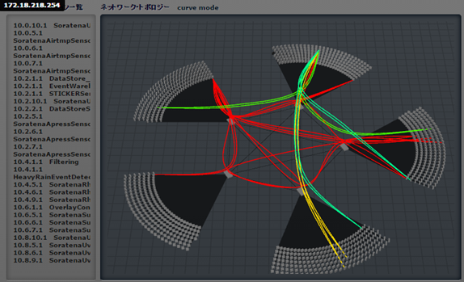
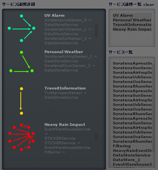
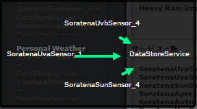
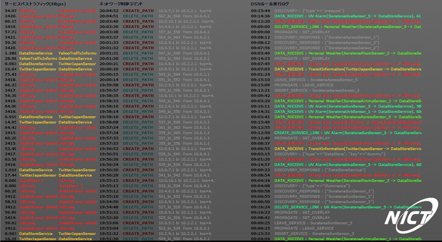
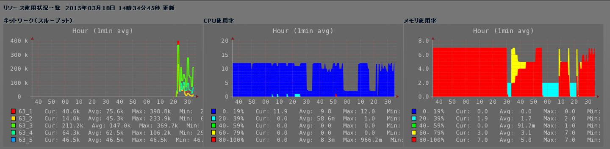
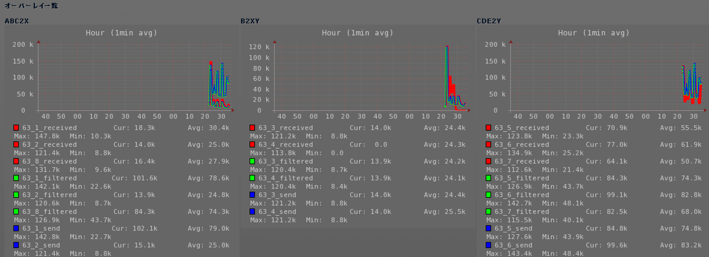

==========
How to use
==========

Starting SCN-Admin
==================

* Access to http://172.18.102.1/static/scnv/index.html using a browser (Google Chrome)

Explanation of screen
=====================

Service location/Network topology display screen
------------------------------------------------------

* The **service location display screen** shows the service name and the IP address of the node on which the service is being run, as shown below.

=========== ========================
IP address  Service name
=========== ========================
10.0.10.1   SoratenaUvaSensor
10.2.1.1    DataStoreService
10.4.1.1    HeavyRainEventDetection
=========== ========================

* The **network topology display screen** shows the service node where SCN is running and the OpenFlow switch to which the service node is connected.
  Furthermore, it shows the service link that connects the node of the data transmission source and the node of the data transmission destination.

Service list/Service cooperation list/Service cooperation detail display screen
-------------------------------------------------------------------------------

* The **service cooperation list display screen** presents a list of the service cooperation names that are controlled by SCN. 
  When the cursor is moved to the service cooperation name, related services will be highlighted at the service list screen and the service cooperation detail screen.

* The **service list display screen** displays a list of the service names that participate in SCN.

* The **service cooperation detail display screen** shows service cooperation by a diagram that is controlled by SCN.
  When clicking the diagram, the transmission source service name and transmission destination service name will be shown with an arrow.

Service path traffic/Network control command/DSN rule execution log display screen
----------------------------------------------------------------------------------

* At the **service path traffic display screen** , transmission and receiving of network traffic will be displayed per the pair of transmission source service and transmission destination service as shown below.

=============================== =================================== ========================================
Network traffic (Mbps)          Service name of transmission source Service name of transmission destination
=============================== =================================== ========================================
1.386                           DataStoreService                    YahooTrafficInformation
28.96                           YahooTrafficInformation             DataStoreService
0.963                           DataStoreService                    TwitterJapanSensor
16.64                           TwitterJapanSensor                  DataStoreService
=============================== =================================== ========================================

* At the **network control command display screen** , the following command log about the network control will be displayed.

  * JOIN_SCN (Join SCN)
  * CREATE_PATH (Create a path)
  * DELETE_PATH (Delete a path)

* At the **DSN rule execution log display screen** , the following log about the DSN execution will be displayed.

  * DISCOVERY (Discover service)
  * CREATE_SERVICE_LINK (Create a channel)
  * DELETE_SERVICE_LINK (Delete a channel)
  * PROPAGATE (Propagate service cooperation information)
  * DATA_RECEIVE (Receive data sent from service)

Starting page for administrator of SCN-Admin
============================================

* Access to http://172.18.102.1/static/scnv/admin.html using a browser (Google Chrome)

  * When accessed, the following user authentication screen is displayed. Then, enter user name and password.

Explanation of screen
=====================
* In addition to displaying SCN-Admin screen, two new screens will be displayed in the administrator page.

Resource usage list screen
----------------------------------------------------------------------------

* At the **resource usage list screen** , the following graph will be displayed showing all resource usage.

============================ ==================================================================================================
Types of graph               Description
============================ ==================================================================================================
Network (Throughput)         Display throughput per overlay/
CPU utilization rate         Display CPU utilization rate of the service node in a different color per the utilization rate.
Memory utilization rate      Display memory utilization rate of the service node in a different color per the utilization rate.
============================ ==================================================================================================

Overlay list screen
----------------------------------------------------------------------------

* At **the overlay list screen** , the channel throughput per overlay will be displayed as a line graph.

======================= ===============================================================
Type of item            Description
======================= ===============================================================
(channel id)_send       Size of data transmitted from the transmission source service
(channel id)_filtered   Size of data processed intermediately by SCN
(channel id)_received   Size of data received by the destination service
======================= ===============================================================

