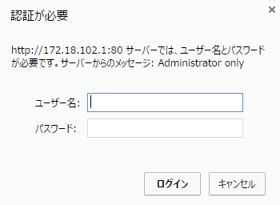

=======
使い方
=======

SCN-Adminの起動
================

* ブラウザ(Google Chrome)で、http://172.18.102.1/static/scnv/index.html にアクセスします。

画面の説明
===========

サービスロケーション/ネットワーク・トポロジー表示画面
------------------------------------------------------

.. image:: img/fig-usage-1.png
      :width: 500px
      :align: center

* **サービスロケーション表示画面** では、以下の例のように、
  サービス名とそのサービスが稼働しているノードのIPアドレスを表示します。

=========== ========================
IPアドレス  サービス名
=========== ========================
10.0.10.1   SoratenaUvaSensor
10.2.1.1    DataStoreService
10.4.1.1    HeavyRainEventDetection
=========== ========================

* **ネットワークトポロジー表示画面** では、SCNが稼働しているサービスノードおよび
  サービスノードが接続しているOpenFlowスイッチを表示します。
  また、データ送信元ノードとデータ送信先ノードをつなぐサービスリンクも表示されます。

サービス一覧/サービス連携一覧/サービス連携詳細表示画面
-------------------------------------------------------
.. image:: img/fig-usage-2.png
      :width: 300px
      :align: center

* **サービス連携一覧表示画面** では、SCNが管理しているサービス連携名を一覧表示します。
  サービス連携名にマウスカーソルを合わせると、サービス一覧画面とサービス連携詳細画面で、
  関連するサービスがハイライトします。

* **サービス一覧表示画面** では、SCNに参加しているサービス名を一覧表示します。

* **サービス連携詳細表示画面** では、SCNが管理しているサービス連携を、図で表示します。
  図をクリックすると、以下のように送信元サービス名、送信先サービス名が矢印とともに表示されます。

.. image:: img/fig-usage-3.png
      :width: 200px
      :align: center

サービスパストラフィック/ネットワーク制御コマンド/DSNルール実行ログ表示画面
----------------------------------------------------------------------------
.. image:: img/fig-usage-4.png
      :width: 600px
      :align: center

* **サービスパストラフィック表示画面** では、以下の例のように、
  送信元サービスと送信先サービスのペアごとに、送受信ネットワークトラフィックを表示します。

=============================== ========================  =========================
ネットワークトラフィック(Mbps)  送信元サービス名          送信先サービス名
=============================== ========================  =========================
1.386                           DataStoreService          YahooTrafficInformation
28.96                           YahooTrafficInformation   DataStoreService
0.963                           DataStoreService          TwitterJapanSensor
16.64                           TwitterJapanSensor        DataStoreService
=============================== ========================  =========================

* **ネットワーク制御コマンド表示画面** では、ネットワーク制御に関する以下のコマンドのログを表示します。

  * JOIN_SCN(SCNの参加)
  * CREATE_PATH(パスの生成)
  * DELETE_PATH(パスの削除)

* **DSNルール実行ログ表示画面** では、DSNの実行に関する以下のログを表示します。

  * DISCOVERY(サービスの検索)
  * CREATE_SERVICE_LINK(チャネルの生成)
  * DELETE_SERVICE_LINK(チャネルの削除)
  * PROPAGATE(サービス連携情報の伝播)
  * DATA_RECEIVE(サービスから送信されたデータの受信)

SCN-Adminの管理者用ページの起動
================================

* ブラウザ(Google Chrome)で、http://172.18.102.1/static/scnv/admin.html にアクセスします。

  * アクセスすると以下の認証画面が表示されますので、ユーザ名とパスワードを入力してください。

画面の説明
===========
* SCN-Adminの表示に加えて、管理者用ページには新たに2つの画面が表示されます。

リソース使用状況一覧画面
----------------------------------------------------------------------------
.. image:: img/fig-usage-6.png
      :width: 600px
      :align: center

* **リソース使用状況一覧画面** では、SCN全体のリソース使用状況として、以下のグラフを表示します。

============================ =============== ============================================================
グラフの種類                 グラフの種類    内容
============================ =============== ============================================================
ネットワーク（スループット） 折れ線          オーバーレイごとのスループットを表示します
CPU使用率                    積み上げ折れ線  サービスノードのCPU使用率を使用率に応じた色で表示します
メモリ使用率                 積み上げ折れ線  サービスノードのメモリ使用率を使用率に応じた色で表示します
============================ =============== ============================================================

オーバーレイ一覧画面
----------------------------------------------------------------------------

* **オーバーレイ一覧画面** では、オーバーレイごとにチャネルのスループットを折れ線グラフで表示します。

======================= ==========================================
項目の種類              内容
======================= ==========================================
(channel id)_send       送信元サービスの送出したデータサイズです
(channel id)_filtered   SCNによる中間処理後のデータサイズです
(channel id)_received   宛先サービスの受信したデータサイズです
======================= ==========================================

